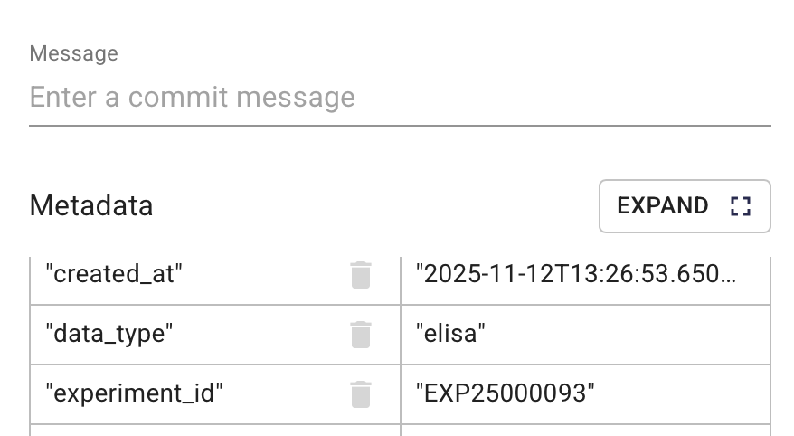
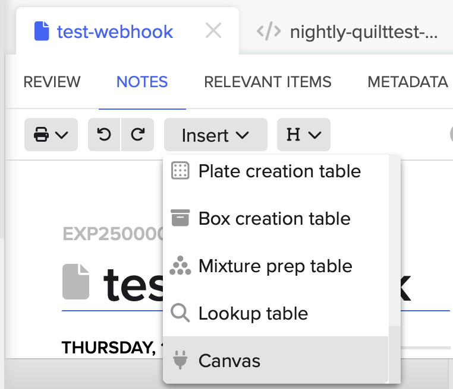

# Benchling Webhook Integration for Quilt

The Benchling Webhook creates a seamless connection between [Benchling](https://www.benchling.com)'s Electronic Lab Notebook (ELN) and [Quilt](https://www.quilt.bio)'s Scientific Data Managements System (SDMS) for Amazon S3.
It not only allows you to view Benchling metadata and attachments inside Quilt packages, but also enables users to browse Quilt package descriptions from inside Benchling notebookes.

The webhook works through a [Benchling App](https://docs.benchling.com/docs/getting-started-benchling-apps) that must be installed in your Organization by a Benchling Administrator and configured to call your stack's unique webhook (see Installation, below).

## Availability

It is available in the Quilt Platform (1.65 or later) or as a standalone CDK stack via the `@quiltdata/benchling-webhook` [npm package](https://www.npmjs.com/package/@quiltdata/benchling-webhook).

## Functionality

### Auto-Packaging


When scientists create notebook entries in Benchling, this webhook automatically:

- **Creates a dedicated Quilt package** for each notebook entry
- **Synchronizes metadata** from Benchling (experiment IDs, authors, etc.) into that package
- **Copies attachments** from that notebook into Amazon S3 as part of the package.
- **Enables orgnizational data discovery** by making contents available in ElasticSearch, and metadata available in Amazon Athena.

### Package Linking



In addition, Quilt users can 'tag' additional packages by setting the `experiment_id` (or a custom metadta key) to the display ID of a Benchling notebook, e.g., `EXP00001234`.

From inside the Quilt Catalog:

1. Navigate to the package of interest
2. Click 'Revise Package'
3. Go the metadata editor in the bottom left
4. In the bottom row, enter `experiment_id` as key and the display ID as the value.
5. Set the commit message and click 'Save'

### Benchling App Canvas


The webhook includes a Benchling App Canvas, which allows Benchling users to view, browse, and sync the associated Quilt packages.

- Clicking the package name opens it in the Quilt Catalog
- The `sync` button will open the package or file in [QuiltSync](https://www.quilt.bio/quiltsync), if you have it installed.
- The `Update` button refreshes the package, as Benchling only notifies Quilt of changes when the metadata fields are modified.

The canvas also allows you to browse package contents:


and view package metadata:


#### Inserting a Canvas

If the App Canvas is not already part of your standard notebook template, Benchling users can add it themselves:

1. Create a notebook entry
2. Select "Insert" → "Canvas"
3. Choose "Quilt Package"
4. After it is inserted, click the "Create" button



## Architecture (v1.0.0)

AWS CDK application with defense-in-depth security:

```
Benchling Webhook
        |
        | HTTPS POST
        v
API Gateway (HTTP API v2)
        |
        | Extract headers + body
        v
Lambda Authorizer ←─────────────┐
        |                        │
        | Verify HMAC signature  │ Defense-in-Depth:
        | - Valid → Allow        │ Both Lambda and
        | - Invalid → 403        │ FastAPI verify
        v                        │ HMAC signatures
VPC Link                         │
        |                        │
        v                        │
Cloud Map (benchling.local)      │
        |                        │
        v                        │
ECS Fargate (FastAPI)   ─────────┘
        |
        | Re-verify HMAC
        | Process webhook
        v
S3 + SQS → Quilt Package
```

### Components

- **API Gateway (HTTP API v2)** - HTTPS webhook routing with Lambda Authorizer integration
- **Lambda Authorizer** - HMAC signature verification (first line of defense, logs to CloudWatch)
- **VPC Link + Cloud Map** - Private service discovery to ECS tasks
- **ECS Fargate** - FastAPI application (auto-scales 2-10 tasks, second line of defense)
- **S3** - Payload and package storage
- **SQS** - Quilt package creation queue
- **Secrets Manager** - Benchling OAuth credentials
- **CloudWatch** - Logging and monitoring for all components

### Security Features

**Defense-in-Depth HMAC Verification:**

1. **Lambda Authorizer Layer** - Verifies webhook signatures before request reaches ECS, rejecting invalid requests with 403 Forbidden
2. **Application Layer** - FastAPI re-verifies signatures for defense-in-depth protection

**Why HTTP API v2?**

- REST API Lambda Authorizers cannot access request body (HMAC verification impossible)
- HTTP API v2 Lambda Authorizers can access body via `event['body']` field
- Benchling HMAC signatures are computed over entire request body
- HTTP API v2 is the only architecture that supports proper webhook signature verification

**Additional Security:**

- Private network (ECS in private subnets, no public IPs)
- TLS 1.2+ encryption on all API Gateway endpoints
- CloudWatch audit trail for all authorization events
- Least-privilege IAM roles

## Installation

### 1. Installing the Benchling App

This requires a Benchling admin to use `npx` from [NodeJS](https://nodejs.org) version 18 or later.

#### 1.1 Generate a manifest

```bash
npx @quiltdata/benchling-webhook@latest manifest
```

This will generate an `app-manifest.yaml` file in your local folder

#### 1.2 Upload the manifest to Benchling

- Follow Benchling's [create](https://docs.benchling.com/docs/getting-started-benchling-apps#creating-an-app-from-a-manifest) and [install](https://docs.benchling.com/docs/getting-started-benchling-apps#installing-your-app) instructions.
- Save the **App Definition ID**, **Client ID**, and **Client Secret** for the next step.

### 2. Configuring the Benchling App

Your command-line environment must have AWS credentials for the account containing your Quilt stack.
All you need to do is use `npx` to run the package:

```bash
npx @quiltdata/benchling-webhook@latest
```

The wizard will guide you through:

1. **Catalog discovery** - Detect your Quilt catalog configuration
2. **Stack validation** - Extract settings from your CloudFormation stack
3. **Credential collection** - Enter Benchling app credentials
4. **Deployment mode selection**:
   - **Integrated**: Uses your Quilt stack's built-in webhook, if any
   - **Standalone**: Deploys a separate webhook stack for testing

**Note**: Configuration is stored in `~/.config/benchling-webhook/` using the [XDG Base Directory](https://wiki.archlinux.org/title/XDG_Base_Directory) standard, supporting multiple profiles.

### 3. Configure Webhook URL

Add the webhook URL (displayed after setup) to your [Benchling app settings](https://docs.benchling.com/docs/getting-started-benchling-apps#installing-your-app).

**Important**: The endpoint URL format is `https://{api-id}.execute-api.{region}.amazonaws.com/webhook` (no stage prefix in path).

### 4. Test Integration

In Benchling:

1. Create a notebook entry
2. Insert Canvas → Select "Quilt Package"
3. Click "Create"

A Quilt package will be automatically created and linked to your notebook entry.
If you run into problems, contact [Quilt Support](support@quilt.bio)

## Monitoring

### CloudWatch Logs

- `/aws/apigateway/benchling-webhook-http` - API Gateway access logs
- `/aws/lambda/BenchlingWebhookAuthorizer` - Lambda Authorizer logs (HMAC verification)
- `/ecs/benchling-webhook` - ECS container logs (application logs)

### View Logs

```bash
# Via AWS CLI
aws logs tail /aws/lambda/BenchlingWebhookAuthorizer --follow
aws logs tail /ecs/benchling-webhook --follow

# Via NPX (all logs combined)
npx @quiltdata/benchling-webhook@latest logs --profile default
```

## Additional Commands

```bash
# Deploy without re-running setup
npx @quiltdata/benchling-webhook@latest deploy [--profile <name>]

# Check CloudFormation stack status
npx @quiltdata/benchling-webhook@latest status [--profile <name>]

# View CloudWatch logs
npx @quiltdata/benchling-webhook@latest logs [--profile <name>]

# Show all available commands
npx @quiltdata/benchling-webhook@latest --help

# Validate Lambda authorizer bundle locally (offline-friendly)
npm run test:lambda-bundle
```

## Upgrading from v0.8.x or v0.9.0

Version 1.0.0 introduces HTTP API v2 with Lambda Authorizer for proper HMAC signature verification. **This is a breaking change that requires stack recreation.**

See [MIGRATION.md](./MIGRATION.md) for detailed upgrade instructions.

**Quick migration:**

```bash
# 1. Backup configuration
cp ~/.config/benchling-webhook/{profile}/config.json ~/backup-config.json

# 2. Destroy old stack
npx cdk destroy --profile {profile} --context stage={stage}

# 3. Deploy new stack
npm run deploy:{stage} -- --profile {profile} --yes

# 4. Update webhook URL in Benchling app settings

# 5. Test
npm run test:{stage} -- --profile {profile}
```

## License

Apache-2.0
