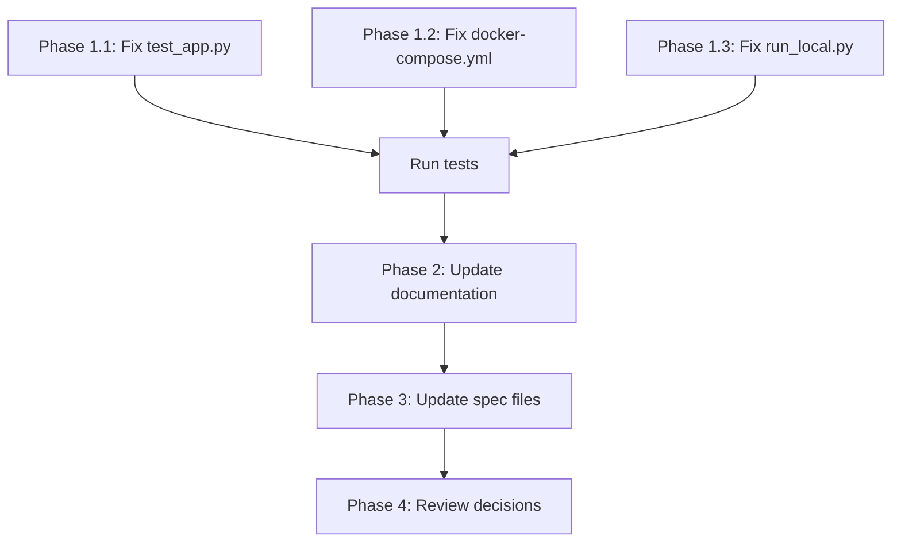

# Queue ARN Migration - Implementation Plan

## Executive Summary

The codebase has **successfully completed** the migration from QUEUE_URL to QUEUE_ARN in all production code. However, **documentation and a few test/development scripts** still reference the old patterns and need updating.

**Key Finding**: The ARN-to-URL conversion in `entry_packager.py` is **correct and necessary** because boto3's `send_message()` API requires a QueueUrl parameter, not a QueueArn.

---

## Current State

### ✅ COMPLETED (Production Code)
- Python configuration (`config.py`) uses `queue_arn`
- Python runtime (`entry_packager.py`) correctly converts ARN to URL for boto3
- TypeScript CDK code uses `queueArn` throughout
- Environment variable is `QUEUE_ARN`
- CloudFormation stack looks for `PackagerQueueArn` output
- IAM policies use ARN in resources
- All production tests updated

### ⚠️ REMAINING WORK
1. **Documentation** - Still references SQS_QUEUE_URL, QUEUE_NAME, sqsQueueUrl
2. **Dev Scripts** - Local development scripts use old QUEUE_URL
3. **Docker Compose** - Uses old QUEUE_URL environment variable
4. **One Test File** - Uses wrong attribute name (queue_url vs queue_arn)

---

## Implementation Phases

### Phase 1: Critical Fixes (Broken Code)

These are actual bugs that will cause runtime errors:

#### 1.1 Fix Test File
**File**: `/Users/ernest/GitHub/benchling-webhook/docker/tests/test_app.py`
**Line 20**: `config.queue_url = "https://sqs.us-west-2.amazonaws.com/123456789012/test"`

**Issue**: The config object has `queue_arn` attribute, not `queue_url`

**Fix**:
```python
# Change from:
config.queue_url = "https://sqs.us-west-2.amazonaws.com/123456789012/test"

# To:
config.queue_arn = "arn:aws:sqs:us-west-2:123456789012:test"
```

**Impact**: Test will fail if run
**Priority**: HIGH
**Estimated Time**: 2 minutes

---

#### 1.2 Fix Docker Compose
**File**: `/Users/ernest/GitHub/benchling-webhook/docker/docker-compose.yml`
**Lines 17, 55**: `- QUEUE_URL=${QUEUE_URL}`

**Issue**: Environment variable name is wrong

**Fix**:
```yaml
# Change from:
- QUEUE_URL=${QUEUE_URL}

# To:
- QUEUE_ARN=${QUEUE_ARN}
```

**Impact**: Docker containers won't have correct env var
**Priority**: HIGH
**Estimated Time**: 2 minutes

---

#### 1.3 Fix Local Development Script
**File**: `/Users/ernest/GitHub/benchling-webhook/docker/scripts/run_local.py`
**Line 32**: `os.environ.setdefault("QUEUE_URL", "...")`

**Issue**: Uses old environment variable name

**Fix**:
```python
# Change from:
os.environ.setdefault("QUEUE_URL", "https://sqs.us-west-2.amazonaws.com/123456789012/test-queue")

# To:
os.environ.setdefault("QUEUE_ARN", "arn:aws:sqs:us-west-2:123456789012:test-queue")
```

**Impact**: Local development won't work correctly
**Priority**: HIGH
**Estimated Time**: 2 minutes

---

### Phase 2: User-Facing Documentation

These affect developers using the project:

#### 2.1 Update Main Documentation Table
**File**: `/Users/ernest/GitHub/benchling-webhook/AGENTS.md`
**Line 102**: Table row for SQS_QUEUE_URL

**Fix**:
```markdown
# Change from:
| `SQS_QUEUE_URL` | From Quilt stack outputs |

# To:
| `QUEUE_ARN` | From Quilt stack outputs (PackagerQueueArn) |
```

**Priority**: MEDIUM
**Estimated Time**: 2 minutes

---

#### 2.2 Update Docker Documentation
**Files**:
- `/Users/ernest/GitHub/benchling-webhook/docker/README.md` (line 182)
- `/Users/ernest/GitHub/benchling-webhook/docker/src/README.md` (line 101)

**Fix**:
```markdown
# Change from:
- `SQS_QUEUE_URL` - SQS queue for Quilt packaging

# To:
- `QUEUE_ARN` - SQS queue ARN for Quilt packaging (from CloudFormation stack outputs)
```

**Priority**: MEDIUM
**Estimated Time**: 5 minutes

---

#### 2.3 Review Validate Command
**File**: `/Users/ernest/GitHub/benchling-webhook/bin/commands/validate.ts`
**Line 89**: `"sqsQueueUrl",`

**Issue**: Validates a field that doesn't exist in the Config interface

**Investigation Needed**:
1. Check if this validation is actually used
2. Determine if it should be removed or changed to "queueArn"

**Fix Option A** (if still needed):
```typescript
// Change from:
"sqsQueueUrl",

// To:
"queueArn",
```

**Fix Option B** (if dead code):
```typescript
// Remove the line entirely
```

**Priority**: MEDIUM
**Estimated Time**: 10 minutes (includes investigation)

---

### Phase 3: Internal Specification Documents

These are internal spec documents that describe proposed CLI behavior. They don't affect runtime but should be updated for consistency.

#### 3.1 Update CLI Specification Files

**Files** (all in `/Users/ernest/GitHub/benchling-webhook/spec/cli/`):
- `QUICK_REFERENCE.md`
- `DOCUMENTATION_UPDATES.md`
- `CLI_SPEC.md`
- `IMPLEMENTATION_SUMMARY.md`
- `REFACTORING_GUIDE.md`
- `EXAMPLES.md`

**Patterns to Update**:

1. **SQS_QUEUE_URL → QUEUE_ARN**
```markdown
# Change from:
SQS_QUEUE_URL=https://sqs.us-east-1.amazonaws.com/123456789012/QuiltStack-PackagerQueue-ABC123

# To:
QUEUE_ARN=arn:aws:sqs:us-east-1:123456789012:QuiltStack-PackagerQueue-ABC123
```

2. **sqsQueueUrl → queueArn**
```typescript
// Change from:
sqsQueueUrl: string;
sqsQueueUrl: envVars.SQS_QUEUE_URL

// To:
queueArn: string;
queueArn: envVars.QUEUE_ARN
```

3. **QUEUE_NAME → Remove or Clarify**
Decision needed: Is QUEUE_NAME still relevant?
- If yes: Keep it separate from QUEUE_ARN
- If no: Remove all references

**Priority**: LOW
**Estimated Time**: 30-60 minutes (depends on scope)

---

### Phase 4: Review and Decision Items

#### 4.1 QUEUE_NAME Variable
**Decision Required**: Should QUEUE_NAME be kept?

**Current Situation**:
- Referenced in many spec files
- NOT used in actual production code
- Appears to be from an earlier design

**Options**:
1. **Keep it** - If there's a use case for having the queue name separate from ARN
2. **Remove it** - If it's obsolete and confusing
3. **Document it** - If it's a derived value (extract name from ARN)

**Recommendation**: REMOVE - It's not used in production code and adds confusion

**Priority**: LOW
**Estimated Time**: Depends on decision

---

#### 4.2 Test Script Review
**File**: `/Users/ernest/GitHub/benchling-webhook/docker/scripts/test_benchling.py`
**Line 53**: `queue_url="https://sqs.us-east-2.amazonaws.com/test/queue",`

**Question**: Is this test script still in use?

**Options**:
1. If used: Update to use queue_arn parameter
2. If unused: Remove the script
3. If part of SDK: Check if SDK needs updating

**Priority**: LOW
**Estimated Time**: 10 minutes (investigation)

---

## Dependency Order

Since some changes depend on others, follow this order:



**Critical Path**: Phase 1 items must be completed before Phase 2

---

## Testing Strategy

### After Phase 1 (Critical Fixes)
```bash
# Test Python code
cd docker
pytest tests/test_app.py
pytest tests/test_config_env_vars.py

# Test docker-compose
cd docker
docker-compose config  # Validate syntax

# Test local run script
cd docker/scripts
python run_local.py --help  # Should not error
```

### After Phase 2 (Documentation)
- Review documentation for consistency
- Ensure all env var examples use QUEUE_ARN

### After Phase 3 (Specs)
- Validate all code examples in specs are consistent
- Ensure specs match actual implementation

---

## Risk Assessment

### Low Risk Changes
- Documentation updates (Phase 2, 3)
- Spec file updates (Phase 3)

### Medium Risk Changes
- test_app.py fix (Phase 1.1) - Could affect tests
- validate.ts review (Phase 2.3) - Could affect CLI behavior

### Potential High Risk
- docker-compose.yml (Phase 1.2) - If used in production
- run_local.py (Phase 1.3) - If developers rely on it

**Mitigation**: Test each change in isolation before moving to next phase

---

## Success Criteria

### Phase 1 Complete
- [ ] All tests pass with QUEUE_ARN
- [ ] Docker compose validates successfully
- [ ] Local development script runs without errors

### Phase 2 Complete
- [ ] All user-facing documentation uses QUEUE_ARN
- [ ] No references to SQS_QUEUE_URL in main docs
- [ ] Validate command updated or decision documented

### Phase 3 Complete
- [ ] All spec files consistent with implementation
- [ ] Code examples in specs use QUEUE_ARN
- [ ] QUEUE_NAME resolved (kept or removed)

### Phase 4 Complete
- [ ] All decision items resolved and documented
- [ ] No outstanding questions about queue configuration
- [ ] Final verification checklist completed

---

## Verification Checklist (Final)

After completing all phases:

```bash
# 1. Search for old patterns
grep -r "SQS_QUEUE_URL" --exclude-dir=.git --exclude-dir=spec/queue_arn .
grep -r "QUEUE_URL" --exclude-dir=.git --exclude-dir=spec/queue_arn . | grep -v "QUEUE_ARN"
grep -r "queue_url" --exclude-dir=.git --exclude-dir=spec/queue_arn . | grep -v "queue_arn"
grep -r "sqsQueueUrl" --exclude-dir=.git --exclude-dir=spec/queue_arn .

# 2. Verify all tests pass
cd docker && pytest
cd .. && npm test

# 3. Verify docker-compose
cd docker && docker-compose config

# 4. Verify CDK synth
npm run cdk synth

# 5. Verify documentation consistency
grep -r "QUEUE_ARN" *.md docker/*.md
```

Expected Results:
- No false positives (only CHANGELOG and historical references)
- All tests passing
- Docker compose valid
- CDK synth successful
- Documentation consistent

---

## Time Estimate

| Phase | Tasks | Estimated Time |
| ------- | ------- | ---------------- |
| Phase 1 | Critical fixes (3 files) | 10-15 minutes |
| Phase 2 | Documentation (3-4 files) | 20-30 minutes |
| Phase 3 | Spec files (6 files) | 30-60 minutes |
| Phase 4 | Review & decisions | 15-30 minutes |
| Testing | Verification | 15-20 minutes |
| **Total** | | **90-155 minutes** |

---

## Notes for Maintainers

### DO NOT CHANGE
1. **ARN-to-URL conversion** in `entry_packager.py` (lines 695-700)
   - This is CORRECT and REQUIRED for boto3
   - boto3's send_message requires QueueUrl parameter, not QueueArn

2. **IAM action name** "sqs:GetQueueUrl" in `fargate-service.ts`
   - This is the AWS API action name (not a variable)

3. **boto3 parameter name** "QueueUrl" in send_message call
   - This is the boto3 API requirement

### UNDERSTAND THE PATTERN
```
CloudFormation Output: PackagerQueueArn
         ↓
Environment Variable: QUEUE_ARN (ARN format)
         ↓
Config Object: queue_arn (ARN format)
         ↓
IAM Policy: uses ARN in resources
         ↓
Runtime Conversion: ARN → URL (for boto3)
         ↓
boto3 API Call: QueueUrl parameter (URL format)
```

This pattern is correct and should be maintained.
